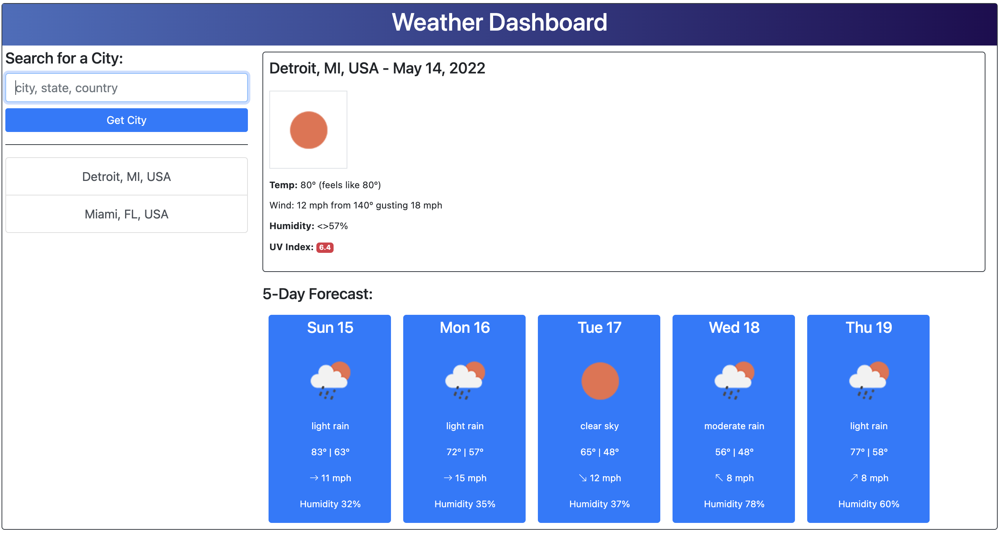

# Challenge 6: Weather Dashboard
##### by: Rich Stanbaugh  

https://rstanbaugh.github.io/weather-dashboard/
 
 

## Description
Weather Dashboard is a web-base application that allows user to input a location and see the current weather as well as a 5-day forecast.

Features include:
- Search by entering: city, state, county, zip code or address into form inputs
- Presented with current and forecast weather for the desired location, including:
  - Icon depicting conditions
  - Temperature / Feels-Like Temperature (current conditions)
  - Wind conditions (including icon depicting direction for forecast weather)
  - Humidity
  - UV Index (current conditions) including a color-coded badge indicating: favorable, moderate or severe conditions.
- Maintains a history of 10 unique searches
  - Most recent search to the top of the list
  - No duplicates in the list
  - clicking on the search history triggers a new search and updates the list
- Search history stored in local storage
- Upon loading, the application loads:
  - The search history weather info for the last-saved search
  - Weather conditions for Miami, FL in case there is no storage history
- The application uses the Position Stack API for geolocation
- The application uses the Open Weather API for weather information
 
 

## Built With  
* HTML  
* CSS  
* Javascript  
* Open Weather API (current weather, 5-day forecast and UV information)
* Position Stack API (geo-locating locations)
* jQuery API
* Moment.js API
* Bootstrap API
 

